# Diagrama de Arquitectura del Sistema - App Turismo

Este diagrama muestra la arquitectura de alto nivel del sistema con sus capas, componentes principales y comunicación.

```mermaid
graph TB
    subgraph "CAPA DE PRESENTACIÓN"
        UI[UI Layer - Flutter Widgets]
        Pages[Pages]
        Widgets[Reusable Widgets]
        
        UI --> Pages
        UI --> Widgets
        
        Pages --> MapaPage[MapaPage]
        Pages --> RutasPage[RutasSegurasPage]
        Pages --> ReportesPage[ReportesPage]
        Pages --> RecommendationsPage[RecommendationsPage]
        Pages --> ProfilePage[ProfilePage]
        Pages --> LoginPage[LoginPage]
        
        Widgets --> ARCamera[ArCameraView]
        Widgets --> ARDanger[ArDangerZoneView]
        Widgets --> WeatherCard[WeatherCard]
        Widgets --> AlertDialog[DangerZoneAlertDialog]
    end
    
    subgraph "CAPA DE LÓGICA DE NEGOCIO"
        Services[Service Layer]
        
        Services --> AuthSvc[AuthService]
        Services --> LocationSvc[LocationService]
        Services --> ZoneSvc[ZoneDetectionService]
        Services --> RouteSvc[RouteDataService]
        Services --> WeatherSvc[WeatherService]
        Services --> ARSvc[ArCalculationService]
        Services --> SurveySvc[ActivitySurveyService]
        Services --> RecoSvc[RecommendationApiService]
        Services --> StorageSvc[StorageService]
    end
    
    subgraph "CAPA DE DATOS"
        DataLayer[Data Layer]
        
        DataLayer --> LocalData[Local Storage]
        DataLayer --> RemoteData[Remote Storage]
        
        LocalData --> Hive[(Hive DB)]
        LocalData --> SharedPrefs[(SharedPreferences)]
        
        RemoteData --> Supabase[(Supabase)]
        RemoteData --> SupabaseStorage[(Supabase Storage)]
    end
    
    subgraph "SERVICIOS EXTERNOS"
        External[External Services]
        
        External --> OpenWeather[OpenWeather API]
        External --> AIService[AI Recommendation API]
        External --> GoogleMaps[Google Maps API]
    end
    
    subgraph "SENSORES Y HARDWARE"
        Hardware[Device Hardware]
        
        Hardware --> GPS[GPS Sensor]
        Hardware --> Compass[Compass]
        Hardware --> Accelerometer[Accelerometer]
        Hardware --> Camera[Camera]
    end
    
    %% Conexiones entre capas
    MapaPage -.->|usa| LocationSvc
    MapaPage -.->|usa| ZoneSvc
    MapaPage -.->|usa| ARSvc
    
    RutasPage -.->|usa| RouteSvc
    RutasPage -.->|usa| WeatherSvc
    
    ReportesPage -.->|usa| StorageSvc
    ReportesPage -.->|usa| LocationSvc
    
    RecommendationsPage -.->|usa| SurveySvc
    RecommendationsPage -.->|usa| RecoSvc
    
    ProfilePage -.->|usa| AuthSvc
    LoginPage -.->|usa| AuthSvc
    
    ARCamera -.->|usa| ARSvc
    ARCamera -.->|usa| LocationSvc
    ARDanger -.->|usa| ZoneSvc
    
    %% Servicios a Datos
    AuthSvc ==>|auth| Supabase
    StorageSvc ==>|CRUD| Supabase
    StorageSvc ==>|fallback| Hive
    RouteSvc ==>|fetch| Supabase
    RouteSvc ==>|images| SupabaseStorage
    ZoneSvc ==>|fetch| Supabase
    SurveySvc ==>|save| Hive
    
    %% Servicios a Externos
    WeatherSvc ==>|HTTP| OpenWeather
    RecoSvc ==>|HTTP| AIService
    MapaPage ==>|display| GoogleMaps
    
    %% Hardware a Servicios
    GPS ==>|position| LocationSvc
    Compass ==>|heading| ARSvc
    Accelerometer ==>|pitch| ARSvc
    Camera ==>|stream| ARCamera
    
    %% Estilos
    classDef presentacion fill:#e1f5ff,stroke:#01579b,stroke-width:2px
    classDef logica fill:#fff3e0,stroke:#e65100,stroke-width:2px
    classDef datos fill:#f3e5f5,stroke:#4a148c,stroke-width:2px
    classDef externos fill:#e8f5e9,stroke:#1b5e20,stroke-width:2px
    classDef hardware fill:#fce4ec,stroke:#880e4f,stroke-width:2px
    
    class UI,Pages,Widgets,MapaPage,RutasPage,ReportesPage,RecommendationsPage,ProfilePage,LoginPage,ARCamera,ARDanger,WeatherCard,AlertDialog presentacion
    class Services,AuthSvc,LocationSvc,ZoneSvc,RouteSvc,WeatherSvc,ARSvc,SurveySvc,RecoSvc,StorageSvc logica
    class DataLayer,LocalData,RemoteData,Hive,SharedPrefs,Supabase,SupabaseStorage datos
    class External,OpenWeather,AIService,GoogleMaps externos
    class Hardware,GPS,Compass,Accelerometer,Camera hardware
```



## Descripción de Capas

### 1. CAPA DE PRESENTACIÓN (UI Layer)
**Responsabilidad**: Interfaz de usuario y experiencia del usuario

**Componentes Principales**:
- **Pages**: Pantallas completas de la aplicación
  - `MapaPage`: Mapa interactivo con zonas de peligro
  - `RutasSegurasPage`: Rutas turísticas seguras
  - `ReportesPage`: Sistema de reportes
  - `RecommendationsPage`: Recomendaciones de IA
  - `ProfilePage`: Perfil de usuario
  - `LoginPage`: Autenticación

- **Widgets Reutilizables**:
  - `ArCameraView`: Vista de cámara para AR
  - `ArDangerZoneView`: Overlay de zonas de peligro
  - `WeatherCard`: Tarjeta de información meteorológica
  - `DangerZoneAlertDialog`: Alertas de zonas peligrosas

**Tecnología**: Flutter Widgets (Material Design)

---

### 2. CAPA DE LÓGICA DE NEGOCIO (Service Layer)
**Responsabilidad**: Lógica de negocio, reglas y coordinación

**Componentes Principales**:

#### Servicios de Autenticación y Usuario
- **AuthService**: Gestión de autenticación (login, registro, logout)

#### Servicios de Ubicación y Navegación
- **LocationService**: Gestión de GPS y posicionamiento
- **ZoneDetectionService**: Detección de zonas de peligro
- **RouteDataService**: Gestión dinámica de rutas y actividades
- **ArCalculationService**: Cálculos para Location-Based AR

#### Servicios de Datos Externos
- **WeatherService**: Información meteorológica en tiempo real
- **RecommendationApiService**: Recomendaciones basadas en IA

#### Servicios de Almacenamiento
- **StorageService**: Patrón Repository (local + remoto)
- **ActivitySurveyService**: Gestión de encuestas de actividades

**Patrón**: Service Layer + Singleton

---

### 3. CAPA DE DATOS (Data Layer)
**Responsabilidad**: Persistencia y acceso a datos

**Almacenamiento Local**:
- **Hive**: Base de datos NoSQL local
  - Encuestas de actividades
  - Caché de datos
  - Datos offline
- **SharedPreferences**: Preferencias de usuario
  - Configuración de la app
  - Tokens de sesión

**Almacenamiento Remoto (Supabase)**:
- **PostgreSQL Database**:
  - `reports`: Reportes de usuarios
  - `safe_routes`: Rutas seguras
  - `danger_zones`: Zonas de peligro
  - `danger_zone_points`: Puntos específicos
  - `route_locations`: Ubicaciones GPS
  - `activity_images`: Imágenes de actividades
  - `user_preferences`: Preferencias

- **Supabase Storage**:
  - `activity-images`: Bucket público para imágenes

**Estrategia**: Híbrido (local-first con sincronización)

---

### 4. SERVICIOS EXTERNOS
**Responsabilidad**: Integración con APIs de terceros

**APIs Integradas**:
- **OpenWeather API**: Datos meteorológicos en tiempo real
- **AI Recommendation API**: Servicio FastAPI propio para recomendaciones
- **Google Maps API**: Mapas interactivos y geocodificación

**Protocolo**: HTTP/REST

---

### 5. SENSORES Y HARDWARE
**Responsabilidad**: Acceso a hardware del dispositivo

**Sensores Utilizados**:
- **GPS**: Posicionamiento geográfico
- **Compass**: Orientación del dispositivo (heading)
- **Accelerometer**: Inclinación del dispositivo (pitch)
- **Camera**: Captura de video para AR

**Tecnología**: Plugins de Flutter (geolocator, sensors_plus, camera)

---

## Flujos de Comunicación

### Flujo de Autenticación
```
LoginPage → AuthService → Supabase
          ← AppUser ←
```

### Flujo de Detección de Zonas de Peligro
```
GPS → LocationService → MapaPage → ZoneDetectionService → Supabase
                                  ← DangerZones ←
```

### Flujo de Location-Based AR
```
Camera → ArCameraView → ArCalculationService
GPS → LocationService ↗
Compass → Hardware ↗
Accelerometer → Hardware ↗
```

### Flujo de Rutas Dinámicas
```
RutasPage → RouteDataService → Supabase (DB + Storage)
          ← [Cache 24h] ←
```

### Flujo de Recomendaciones IA
```
RecommendationsPage → ActivitySurveyService → Hive
                    → RecommendationApiService → AI API (FastAPI)
                    ← ActivityRecommendations ←
```

### Flujo de Reportes (Híbrido)
```
ReportesPage → StorageService → Supabase (primario)
                              → Hive (fallback)
```

---

## Patrones Arquitectónicos Aplicados

### 1. **Layered Architecture** (Arquitectura en Capas)
- Separación clara entre Presentación, Lógica y Datos
- Cada capa solo conoce la capa inmediatamente inferior

### 2. **Repository Pattern**
- `StorageService` abstrae la fuente de datos
- Permite cambiar entre local y remoto transparentemente

### 3. **Service Layer Pattern**
- Servicios encapsulan lógica de negocio
- Reutilizables entre diferentes páginas

### 4. **Singleton Pattern**
- Servicios implementados como singletons
- Una sola instancia compartida en toda la app

### 5. **Caching Strategy**
- Caché de 24 horas en `RouteDataService`
- Caché de zonas de peligro en `ZoneDetectionService`
- Mejora rendimiento y soporte offline

### 6. **Offline-First**
- Datos guardados localmente primero
- Sincronización con Supabase cuando hay conexión
- Fallback automático a datos locales

---

## Características de la Arquitectura

### ✅ Escalabilidad
- Capas independientes facilitan crecimiento
- Servicios modulares permiten agregar funcionalidades

### ✅ Mantenibilidad
- Separación de responsabilidades clara
- Código organizado por dominio

### ✅ Testabilidad
- Servicios aislados fáciles de testear
- Interfaces permiten mocking

### ✅ Rendimiento
- Caché multinivel (memoria + local + remoto)
- Carga asíncrona de datos
- Optimización de consultas

### ✅ Resiliencia
- Soporte offline completo
- Fallback automático a datos locales
- Manejo de errores en cada capa

---

## Tecnologías por Capa

| Capa | Tecnologías |
|------|-------------|
| **Presentación** | Flutter, Material Design, Google Maps Flutter |
| **Lógica** | Dart, Streams, Futures, Singleton Pattern |
| **Datos Local** | Hive, SharedPreferences |
| **Datos Remoto** | Supabase (PostgreSQL + Storage), RLS |
| **Externos** | OpenWeather API, FastAPI, Google Maps API |
| **Hardware** | Geolocator, Sensors Plus, Camera Plugin |

---

## Seguridad

- **RLS (Row Level Security)** en todas las tablas de Supabase
- **Autenticación** mediante Supabase Auth
- **API Keys** almacenadas en `.env` (no en código)
- **Políticas de acceso** diferenciadas (anon vs authenticated)
