# Diagrama de Clases - App Turismo

Este diagrama muestra las clases principales del sistema con sus relaciones, cardinalidades e interfaces.

```mermaid
classDiagram
    %% ============ INTERFACES Y CLASES ABSTRACTAS ============
    class ReportsRemoteDataSource {
        <<interface>>
        +fetchReports() Future~List~Report~~
        +createReport(Report) Future~void~
        +deleteReport(String) Future~void~
    }
    
    %% ============ MODELOS DE DATOS ============
    class Report {
        +String id
        +String typeId
        +String description
        +double? latitude
        +double? longitude
        +DateTime createdAt
        +fromJson(Map) Report
        +toJson() Map
    }
    
    class SafeRoute {
        +String name
        +String duration
        +String difficulty
        +String description
        +List~String~ pointsOfInterest
        +fromJson(Map) SafeRoute
        +toJson() Map
    }
    
    class DangerZone {
        +String id
        +String title
        +String description
        +DangerLevel level
        +LatLng center
        +double radius
        +List~DangerZonePoint~ points
        +fromJson(Map) DangerZone
    }
    
    class DangerZonePoint {
        +String id
        +String title
        +String description
        +LatLng location
        +double radius
        +fromJson(Map) DangerZonePoint
    }
    
    class ActivitySurvey {
        +String id
        +String activityLevel
        +List~String~ preferredActivities
        +DateTime timestamp
        +toJson() Map
    }
    
    class ActivityRecommendation {
        +String id
        +String activityName
        +String description
        +String location
        +double? confidence
        +List~String~ reasons
        +fromJson(Map) ActivityRecommendation
    }
    
    class WeatherData {
        +double temperature
        +String description
        +double windSpeed
        +int humidity
        +fromJson(Map) WeatherData
    }
    
    class AppUser {
        +String id
        +String email
        +String? displayName
    }
    
    %% ============ SERVICIOS PRINCIPALES ============
    class AuthService {
        -SupabaseClient _supabase
        +signIn(email, password) Future~AppUser~
        +signUp(email, password) Future~AppUser~
        +signOut() Future~void~
        +getCurrentUser() AppUser?
    }
    
    class SupabaseService {
        -SupabaseClient _client
        +fetchReports() Future~List~Report~~
        +createReport(Report) Future~void~
        +deleteReport(String) Future~void~
    }
    
    class RouteDataService {
        -SupabaseClient _supabase
        -Map~String, LatLng~? _cachedLocations
        -Map? _cachedImages
        +getRouteLocations() Future~Map~
        +getActivityImages(route, activity) Future~List~String~~
        +getAllActivityImages() Future~Map~
        +clearCache() void
    }
    
    class ZoneDetectionService {
        -SupabaseClient _supabase
        -List~DangerZone~ _cachedZones
        +loadDangerZones() Future~List~DangerZone~~
        +isInsideZone(Position, DangerZone) bool
        +getActiveZones(Position) List~DangerZone~
    }
    
    class LocationService {
        -Position? _currentPosition
        -StreamController _controller
        +getCurrentPosition() Future~Position~
        +getPositionStream() Stream~Position~
        +refresh() Future~void~
    }
    
    class WeatherService {
        -String _apiKey
        -WeatherData? _currentWeather
        +getWeatherByCoordinates(lat, lng) Future~WeatherData~
        +startAutoUpdate(lat, lng) void
        +stopAutoUpdate() void
    }
    
    class ArCalculationService {
        +calculateDistance(origin, destination) double
        +calculateBearing(origin, destination) double
        +isWithinFov(bearing, heading) bool
        +calculateScreenPosition(...) Offset?
    }
    
    class ActivitySurveyService {
        -LocalStorageService _storage
        +saveSurvey(ActivitySurvey) Future~void~
        +getSurvey() Future~ActivitySurvey?~
        +hasSurvey() Future~bool~
    }
    
    class RecommendationApiService {
        -String _baseUrl
        +getRecommendations(survey, activities) Future~List~ActivityRecommendation~~
    }
    
    class StorageService {
        -LocalStorageService _local
        -SupabaseService _remote
        +saveReport(Report) Future~void~
        +getReports() Future~List~Report~~
        +deleteReport(String) Future~void~
    }
    
    class LocalStorageService {
        -Box _box
        +saveData(key, value) Future~void~
        +getData(key) Future~dynamic~
        +deleteData(key) Future~void~
    }
    
    %% ============ RELACIONES ============
    
    %% Implementación de interfaces
    SupabaseService ..|> ReportsRemoteDataSource : implements
    
    %% Composición (tiene-un fuerte)
    DangerZone *-- "1..*" DangerZonePoint : contains
    ActivitySurvey o-- "0..*" ActivityRecommendation : generates
    
    %% Asociación (usa)
    AuthService --> AppUser : manages
    SupabaseService --> Report : handles
    RouteDataService --> SafeRoute : provides data
    ZoneDetectionService --> DangerZone : manages
    ZoneDetectionService --> DangerZonePoint : detects
    WeatherService --> WeatherData : provides
    ActivitySurveyService --> ActivitySurvey : stores
    RecommendationApiService --> ActivityRecommendation : generates
    
    %% Dependencias
    StorageService ..> LocalStorageService : uses
    StorageService ..> SupabaseService : uses
    ArCalculationService ..> LocationService : uses
    ActivitySurveyService ..> LocalStorageService : uses
    
    %% Servicios que usan modelos
    LocationService ..> Report : provides location
    WeatherService ..> SafeRoute : provides weather for
```

## Descripción de Relaciones

### Interfaces
- **ReportsRemoteDataSource**: Define el contrato para fuentes de datos remotas de reportes
  - Implementada por: `SupabaseService`

### Composición (◆)
- **DangerZone ◆→ DangerZonePoint** (1..*): Una zona de peligro contiene uno o más puntos específicos. Los puntos no existen sin la zona.

### Agregación (◇)
- **ActivitySurvey ◇→ ActivityRecommendation** (0..*): Una encuesta puede generar cero o más recomendaciones. Las recomendaciones pueden existir independientemente.

### Asociación (→)
- **AuthService → AppUser**: Gestiona usuarios
- **SupabaseService → Report**: Maneja reportes
- **RouteDataService → SafeRoute**: Provee datos de rutas
- **ZoneDetectionService → DangerZone**: Gestiona zonas de peligro
- **WeatherService → WeatherData**: Provee datos del clima

### Dependencia (⋯>)
- **StorageService ⋯> LocalStorageService**: Usa almacenamiento local
- **StorageService ⋯> SupabaseService**: Usa almacenamiento remoto
- **ActivitySurveyService ⋯> LocalStorageService**: Depende de almacenamiento local

## Patrones de Diseño Aplicados

### 1. Singleton
- `RouteDataService.instance`
- `LocationService.instance`
- `WeatherService.instance`
- `ActivitySurveyService.instance`

### 2. Repository Pattern
- `StorageService`: Abstrae la fuente de datos (local vs remoto)
- `SupabaseService`: Implementa acceso a datos remotos

### 3. Service Layer
- Todos los servicios encapsulan lógica de negocio
- Separación clara entre datos y presentación

### 4. Caching Strategy
- `RouteDataService`: Caché de 24 horas para datos de rutas
- `ZoneDetectionService`: Caché de zonas de peligro
- `WeatherService`: Caché de datos meteorológicos

### 5. Strategy Pattern (implícito)
- `ReportsRemoteDataSource`: Permite diferentes implementaciones de fuentes de datos

## Cardinalidades

- **1:1** - AuthService ↔ AppUser (un servicio gestiona un usuario a la vez)
- **1:N** - DangerZone → DangerZonePoint (una zona tiene múltiples puntos)
- **1:N** - ActivitySurvey → ActivityRecommendation (una encuesta genera múltiples recomendaciones)
- **N:1** - Múltiples servicios → LocalStorageService (varios servicios usan el mismo almacenamiento)

## Notas de Implementación

- Todos los modelos implementan `fromJson()` y `toJson()` para serialización
- Los servicios usan `Future` para operaciones asíncronas
- Se utiliza `Stream` para datos en tiempo real (LocationService)
- Caché implementado en servicios críticos para mejor rendimiento offline
