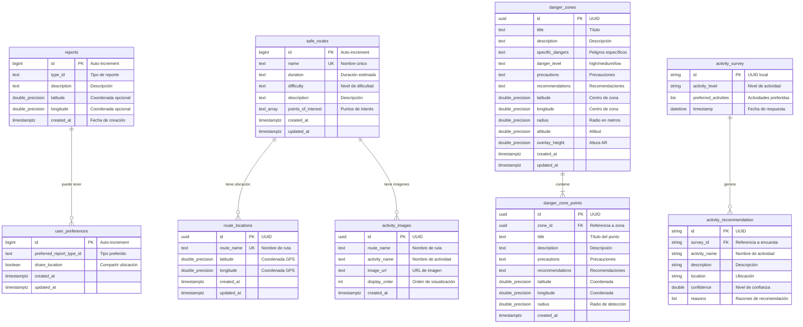

# Diagrama Entidad-Relación (ER) - App Turismo

Este diagrama muestra la estructura de la base de datos de Supabase con todas las tablas, relaciones y cardinalidades.

## Relaciones y Cardinalidades

### 1:N (Uno a Muchos)
- **safe_routes → route_locations**: Una ruta tiene una ubicación GPS
- **safe_routes → activity_images**: Una ruta puede tener múltiples imágenes de actividades
- **danger_zones → danger_zone_points**: Una zona de peligro contiene múltiples puntos específicos
- **activity_survey → activity_recommendation**: Una encuesta genera múltiples recomendaciones

### 0:N (Cero a Muchos)
- **reports ← user_preferences**: Las preferencias pueden estar asociadas a reportes (opcional)

## Índices Principales

- `idx_reports_created_at`: Búsqueda por fecha de reportes
- `idx_reports_type_id`: Filtrado por tipo de reporte
- `idx_safe_routes_name`: Búsqueda por nombre de ruta
- `idx_route_locations_route_name`: Búsqueda de ubicaciones por ruta
- `idx_activity_images_route_name`: Filtrado de imágenes por ruta
- `idx_activity_images_display_order`: Ordenamiento de imágenes
- `idx_danger_zones_level`: Filtrado por nivel de peligro
- `idx_danger_zones_location`: Búsqueda geoespacial

## Políticas RLS (Row Level Security)

Todas las tablas tienen RLS habilitado con políticas de:
- **Lectura pública**: Usuarios anónimos y autenticados
- **Escritura autenticada**: Solo usuarios autenticados pueden insertar/actualizar
- **Eliminación autenticada**: Solo usuarios autenticados pueden eliminar

## Storage Buckets

- **activity-images**: Almacenamiento público para imágenes de actividades turísticas
